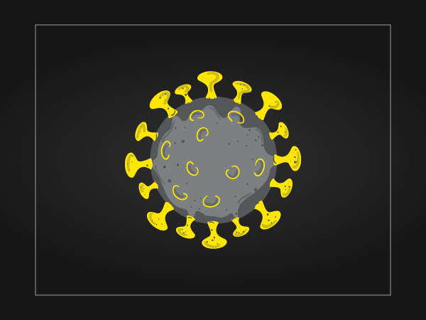
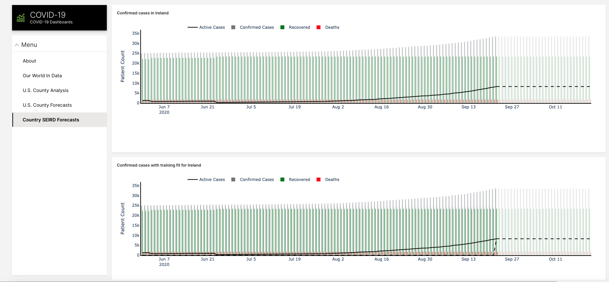
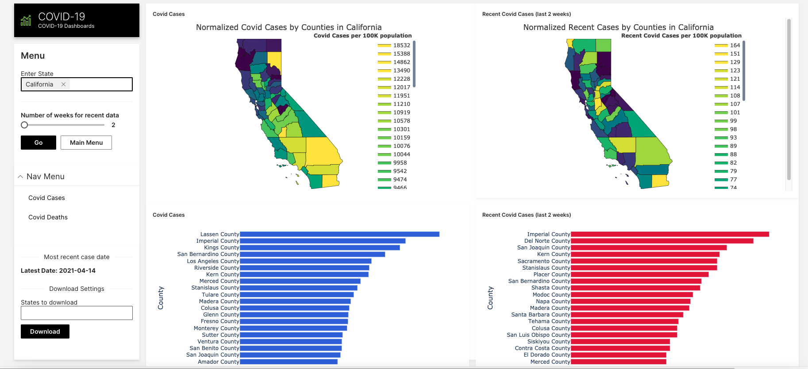

# :clipboard: Overview 

 

{ align=left width="380" }
<h1 style="margin-bottom: -20px;">COVID-19</h1>
<h3>COVID-19 dashboards and forecasts based on latest case data.</h3>

This application analyzes and forecasts Covid-19 cases in the US and across the world. It has multiple modules described below.

 
 
**Features:**

- **Our World In Data:** Aggregates Covid-19 cases, deaths and tests by countries across the globe and normalizes the data by population. Estimated number of deaths for other causes is also shown.
- **U.S. County Analysis:** Aggregates Covid-19 cases and deaths by counties across US states and normalizes the data by population. Displays descriptive dashboards based on case data.

- **U.S. County Forecasts:** Forecast admissions in U.S. County hospitals given adverse conditions, demographics and diseases.

- **Country SEIRD Forecasts:** Uses SEIRD model to forecast COVID-19 cases. The SEIR algorithm is a common epidemiological tool to model diseases such as Covid-19. This app implements a variation (called SEIRD), Source

## Access COVID-19

## COVID-19 Screenshots 

