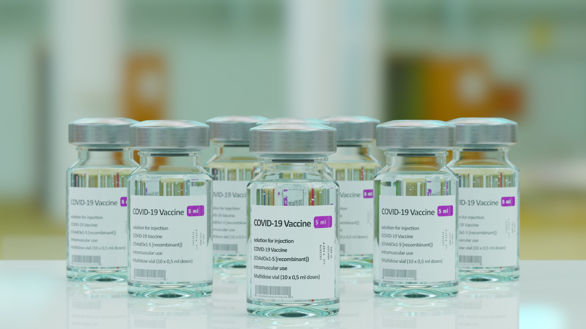

# :material-file-document-outline: Overview 

{ align=left width="380" }
<h1 style="margin-bottom: -25px; margin-top: 55px;">COVID-19 Vaccine NLP</h1>
<h3>Interpret Vaccine Information from Social Media Streams</h3>

v0.1.2 (latest)

 

## Description

This application demonstrates the use of AI in extracting information from Social Media platforms.

**Features:**

- **Information Extraction:** Extract useful information using State-Of-The-Art NLP techniques
- **Clustering:** Cluster documents into user defined groups
- **Dashboards:** Present dashboards with insights

## Access COVID-19 Vaccine NLP

**COVID-19 Vaccine NLP** is available in the H2O Cloud. To learn how to access it, see [Access H2O Healthcare Apps]().

 
=== "Feedback"
    - :material-file-outline: <a href="" target="_blank">Submit and view feedback for this page</a>
    - :material-package-variant-closed: Send feedback about H2O Healthcare to <trushant.kalyanpur@h2o.ai>
