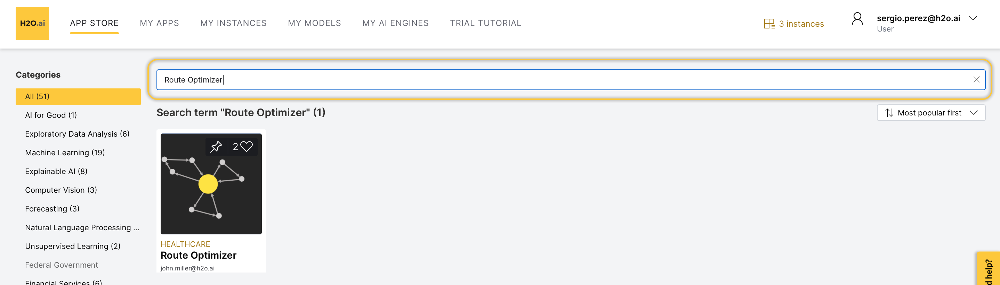
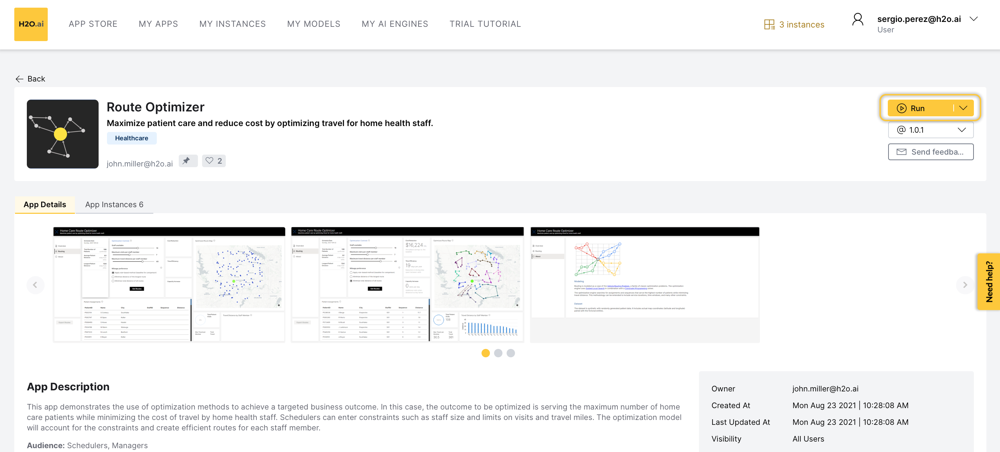
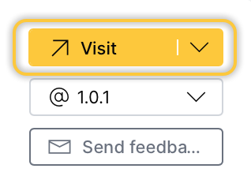
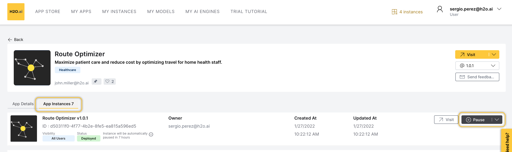
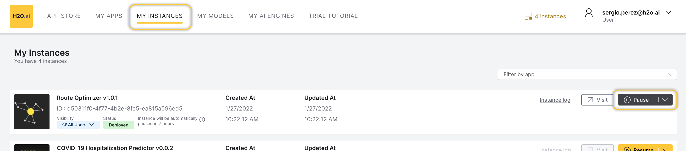
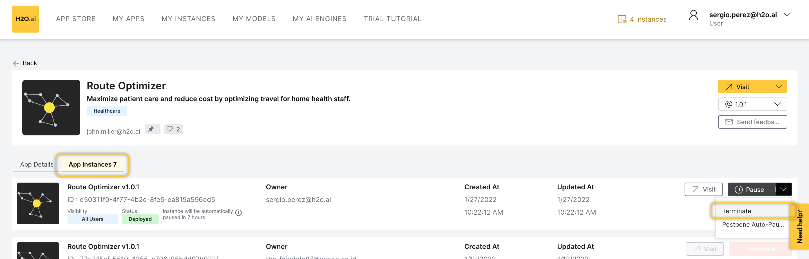
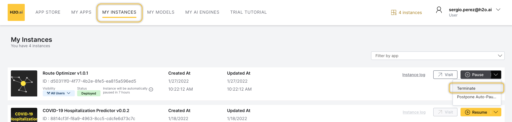

# :material-door: Access H2O Health Apps  


You can access H2O Health apps through the  <a href="https://cloud.h2o.ai/login?referer=%2F" target="_blank" >H2O AI Cloud (HAC)</a>. To access a particular app, refer to the following steps: 

- [Step 1: Access your account](#step-1-access-your-account)
- [Step 2: Search app](#step-2-search-app)
- [Step 3: Run app](#step-3-run-app)
- [Step 4: Access app instance](#step-4-access-app-instance)


!!! note 

    You can access a particular app through an instance of it. 


## Step 1: Access your account

Access your <a href="https://cloud.h2o.ai/login?referer=%2F" target="_blank" >HAC</a>  account. 


!!! note

    To obtain a HAC account, please email <niki.athanasiadou@h2o.ai>.


## Step 2: Search app

In the **HAC** search bar, search ```name_of_app```, in this case, ```name_of_app``` refers to the name of the app you want to access (e.g., Route Optimizer): 

<figure>
  
</figure>

Now, select the app card, the *app details* page appears containing information about the app. 

!!! note 

    Instead of searching for health apps, you can click the **Healthcare** in the HAC navigation menu. On the **Healthcare** page, you can explore all available H2O Health apps. 
## Step 3: Run app 

To start an instance, click **Run App**:

<figure>
  
</figure>

## Step 4: Access app instance

Now, HAC is starting an instance of the app for you. While you have a starting/running instance, the **Run App** button will change its name to **Go to Instance**. To open the app in a new tab, click **Visit**:

<figure>
  
</figure>

!!! note 
    
    - In the app instance, several items will be installed. Right after, you will be able to use it. All items are automatically installed when you start an instance.
    - To learn how to pause or terminate an instance, see [Pause or Terminate Instance](#pause-or-terminate-instance). 

## Pause or Terminate Instance

An app instance can be paused or terminated. Pausing the instance saves computational time and resources. Terminating an instance will delete the instance permanently. 

!!! note 

    - Customers pay for <a href="https://cloud.h2o.ai/login?referer=%2F" target="_blank" >H2O AI Cloud</a>  via AI Units so that as they consume more resources, they pay more. 

    - By default, each instance takes 4 AI Units. 


=== "To pause instance"

    1. In the *app details* page, click the **App Instances** tab. 
    2. Locate your instance row.
    3. Click **Pause**:

    <figure>
      
    </figure>

    You can also **Pause** the instance in the **My Instances** page: 


    1. In the **HAC** menu, select **My Instances**:
    2. Locate your instance row.
    3. Click **Pause**.

    <figure>
      
    </figure>


=== "To terminate instance"
    
    1. In the *app details* page, click the **App Instances** tab. 
    2. Locate your instance row. 
    3. Click :material-chevron-down: **Down Arrow**. 
    2. Click **Terminate**: 

    <figure>
      
    </figure>

    You can also **Terminate** the instance in the **My Instances** page: 

    1. In the **HAC** menu, select **My Instances**.
    2. Locate your instance row.
    3. Click :material-chevron-down: **Down Arrow**. 
    4. Click **Terminate**.

    <figure>
      
    </figure>


<br>
=== "Feedback"
    - :material-file-outline: <a href="https://github.com/h2oai/h2o-health/issues/new?assignees=5675sp&labels=h2o_health%2Fdocumentation&template=general_documentation_feedback.md&title=%5BH2O+Health+DOCS%5D" target="_blank">Submit and view feedback for this page</a>
    - :material-package-variant-closed: Send feedback about H2O Health to <niki.athanasiadou@h2o.ai>


