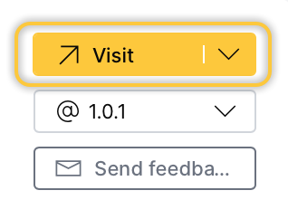

import Tabs from '@theme/Tabs';
import TabItem from '@theme/TabItem';
import Icon from "@material-ui/core/Icon";
import {interpolate} from '@docusaurus/Interpolate';
const feedback = interpolate('https://github.com/h2oai/docs-issues-requests/issues/new?assignees=5675sp&labels=area%2Fdocumentation%2C+h2o-health%2C+haic-app&body=%23%23%23%20Documentation%20issue%2Frequest%0A%0A%3C!--%20Please%20provide%20a%20clear%20and%20concise%20description%20of%20the%20documentation%20issue%2Frequest%20--%3E%0A%0A%23%23%23%20Additional%20context%0A%0A%3C!--%20Please%20add%20any%20other%20context%20about%20the%20issue%2Frequest%20here%20(e.g.%2C%20images)%20--%3E%0A%0A%23%23%23%20Page%20details%20%0A%0A-%20Application%20name%3A%20H2O%20Health%0A-%20Application%20version%3A%20{version}%0A-%20Page%20title%3A%20{title}%20&title=%5BHAIC-APP%5D', {title: metadata.permalink, version: metadata.version});

# Access H2O Health apps  

You can access H2O Health apps through the [H2O AI Cloud (HAIC)](https://cloud.h2o.ai/login?referer=%2F). To access a particular app:

- [Step 1: Access your account](#step-1-access-your-account)
- [Step 2: Search app](#step-2-search-app)
- [Step 3: Run app](#step-3-run-app)
- [Step 4: Access app instance](#step-4-access-app-instance)

:::info Note
You can access a particular app through an instance of it. 
:::

## Step 1: Access your account

Access your [HAIC](https://cloud.h2o.ai/login?referer=%2F) account. 

:::info Note
  To obtain a HAIC account, please email <niki.athanasiadou@h2o.ai>.
:::

## Step 2: Search app

In the **HAIC** search bar, search ```name_of_app```, in this case, ```name_of_app``` refers to the name of the app you want to access (e.g., Route Optimizer): 


Now, select the app card, the *app details* page appears containing information about the app. 

:::info Note
  Instead of searching for health apps, you can click the **Healthcare** in the HAIC navigation menu. On the **Healthcare** page, you can explore all available H2O Health apps. 
:::
## Step 3: Run app 

To start an instance, click **Run App**:


## Step 4: Access app instance

Now, HAIC is starting an instance of the app for you. While you have a starting/running instance, the **Run App** button will change its name to **Go to Instance**. To open the app in a new tab, click **Visit**:



:::info Note  
  - In the app instance, several items will be installed. Right after, you will be able to use it. All items are automatically installed when you start an instance.
  - To learn how to pause or terminate an instance, see [Pause or Terminate Instance](#pause-or-terminate-instance). 
:::

## Pause or terminate instance

An app instance can be paused or terminated. Pausing the instance saves computational time and resources. Terminating an instance will delete the instance permanently. 

:::info Note
  - Customers pay for [H2O AI Cloud](https://cloud.h2o.ai/login?referer=%2F) via AI Units so that as they consume more resources, they pay more. 
:::

<Tabs className="unique-tabs">
  <TabItem value="pause" label="Pause" default>
  You can <b>Pause</b> an instance in the <i>app details</i> page:
  <br></br>
  <br></br>
  <ol>
    <li>In the <b>app details</b> page, click the <b>App Instances</b> tab. </li>
    <li>Locate your instance row.</li>
    <li>Click <b>Pause</b>.</li>
    <br/>
    
  </ol>

  You can also **Pause** an instance in the **My Instances** page:

  <ol>
    <li>In the <b>H2O AI Cloud</b> menu, click <b>My Instances</b>.</li>
    <li>Locate your instance row.</li>
    <li>Click <b>Pause</b>.</li>
    <br/>
    
  </ol>
  </TabItem>
  <TabItem value="terminate" label="Terminate">
  You can <b>Terminate</b> an instance in the <b>app details</b> page:
  <br></br>
  <br></br>
  <ol>
    <li>In the <b>app details</b> page, click the <i>App Instances</i> tab. </li> 
    <li>Locate your instance row.</li>
    <li>Click <Icon>expand_more</Icon> <b>Expand</b>. </li>
    <li>Click <b>Terminate</b>.</li>
    <br/>
    
  </ol>

  You can also **Terminate** an instance in the **My Instances** page: 

  <ol>
    <li>In the <b>H2O AI Cloud</b> menu, click <b>My Instances</b>.</li>
    <li>Locate your instance row.</li>
    <li>Click <Icon>expand_more</Icon> <b>Expand</b>.</li>
    <li>Click <b>Terminate</b>.</li>
    <br/>
    
    </ol>
    </TabItem>
</Tabs>


***
:::note Feedback
  - <a href={feedback}>Submit and view feedback for this page</a>
  - Send feedback about H2O Health to <cloud-feedback@h2o.ai>
:::


