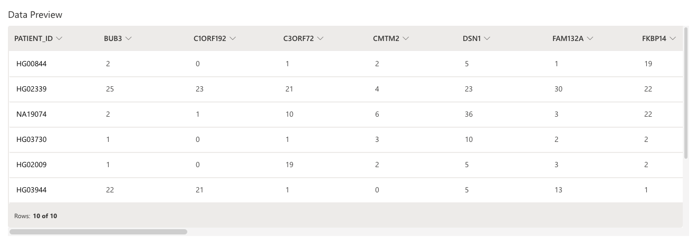
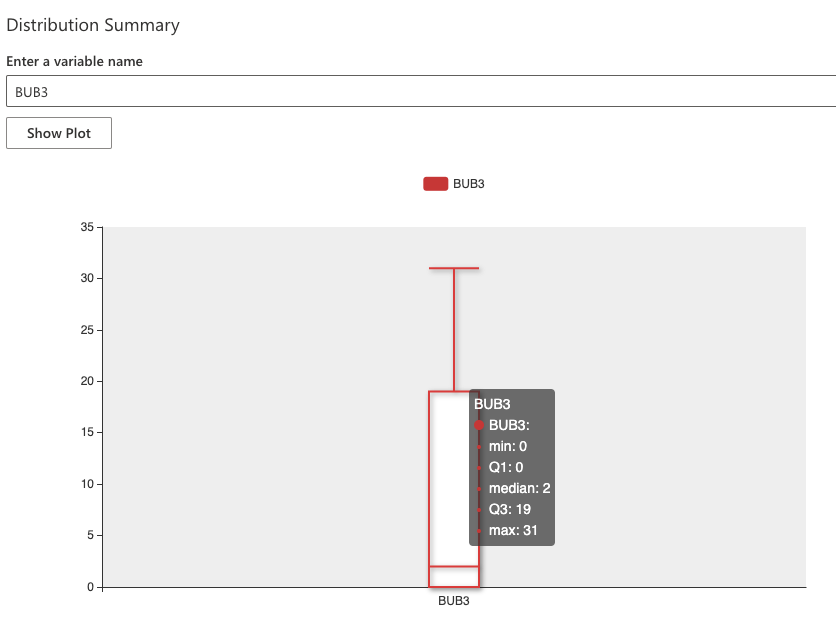

import {interpolate} from '@docusaurus/Interpolate';
const feedback = interpolate('https://github.com/h2oai/docs-issues-requests/issues/new?assignees=5675sp&labels=area%2Fdocumentation%2C+h2o-health%2C+haic-app&body=%23%23%23%20Documentation%20issue%2Frequest%0A%0A%3C!--%20Please%20provide%20a%20clear%20and%20concise%20description%20of%20the%20documentation%20issue%2Frequest%20--%3E%0A%0A%23%23%23%20Additional%20context%0A%0A%3C!--%20Please%20add%20any%20other%20context%20about%20the%20issue%2Frequest%20here%20(e.g.%2C%20images)%20--%3E%0A%0A%23%23%23%20Page%20details%20%0A%0A-%20Application%20name%3A%20H2O%20Health%0A-%20Application%20version%3A%20{version}%0A-%20Page%20title%3A%20{title}%20&title=%5BHAIC-APP%5D', {title: metadata.permalink, version: metadata.version});

# Datasets 

On the **Datasets** page, you can view imported and uploaded datasets.

- To learn how to import a dataset (table), see [Import Snowflake table](../snowflake/snowflake.md#import-snowflake-table).
- To learn how to upload a dataset, see [Upload dataset](#upload-dataset).

## Upload dataset 

To upload a new dataset, consider the following instructions: 

1. In the **Gene Mutation AI** menu, click **Datasets**. 
2. By default, during the process of uploading a dataset, Gene Mutation AI will score the uploaded dataset with the preloaded  ‘default’ model. It enables the calculation of mutation frequencies by pathway, which is the data frame that will be imported to the application. If you want to turn this **off**: 
    - To turn it **off**, click the **Run the data through pre-processing pipeline** toggle.
3. If non-genic information such as demographics or ground truth diagnoses is present, please define their column names as follows: 
    - In the **Select columns to retain after pre-processing** box,  
2. To upload your dataset either: 
    - Click **Browse...**. 
    - Or drag and drop a file (containing the dataset)
3. Click **Upload new dataset**. 

:::info Note
- The dataset should be in a `.csv` or `.txt` file format, where each row is a patient sample and each column a gene name. Allowed values are 1/0, indicating the presence/absence of detected SNP(s) within the gene’s ORF.
- Uploaded datasets through the UI will be stored at the instance level. 
:::

## View dataset 

To view imported or uploaded datasets (table), consider the following instructions: 

1. In the **Gene Mutation AI** menu, click **Datasets**. 
2. In the **Select an existing dataset** list, select the dataset (table) you want to view. 
3. Click **View Dataset**. 
    
    :::info Note 
      A maximum of *10* rows and N columns will be displayed. N refers to the number of columns in the dataset (table). 
    :::

## Distribution summary 

To view a barplot of the cohort distribution of mutation frequencies for a particular gene (column) from a [dataset in view](#view-dataset), consider the following instructions: 

1. In the **Enter a variable name** box, enter one of the column names. 
    :::info Note
      Case sensitive. The entered column name needs to match the column name in the dataset (table). 
    :::
2. Click **Show Plot**. 
    
    :::info Note
      Although a maximum of 10 rows are displayed when viewing a dataset (table), the barplots in the distribution summary are generated using the complete dataset in view. 
    :::

***
:::note Feedback
  - <a href={feedback}>Submit and view feedback for this page</a>
  - Send feedback about H2O Health to <cloud-feedback@h2o.ai>
:::