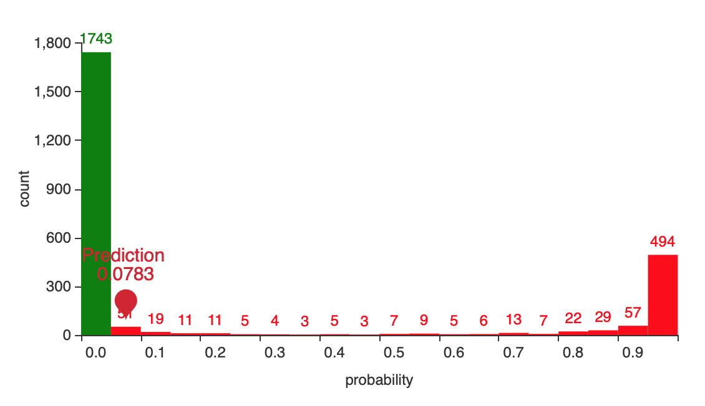
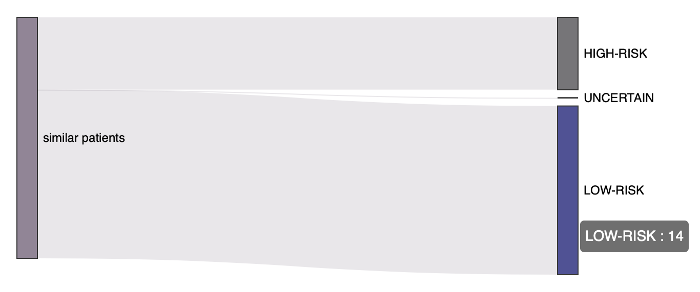

import {interpolate} from '@docusaurus/Interpolate';
const feedback = interpolate('https://github.com/h2oai/docs-issues-requests/issues/new?assignees=5675sp&labels=area%2Fdocumentation%2C+h2o-health%2C+haic-app&body=%23%23%23%20Documentation%20issue%2Frequest%0A%0A%3C!--%20Please%20provide%20a%20clear%20and%20concise%20description%20of%20the%20documentation%20issue%2Frequest%20--%3E%0A%0A%23%23%23%20Additional%20context%0A%0A%3C!--%20Please%20add%20any%20other%20context%20about%20the%20issue%2Frequest%20here%20(e.g.%2C%20images)%20--%3E%0A%0A%23%23%23%20Page%20details%20%0A%0A-%20Application%20name%3A%20H2O%20Health%0A-%20Application%20version%3A%20{version}%0A-%20Page%20title%3A%20{title}%20&title=%5BHAIC-APP%5D', {title: metadata.permalink, version: metadata.version});

# Predictions

## Generate predictions 

To generate a disease prediction for a patient or a set of disease predictions for a cohort of patients, consider the following instructions: 

1. In the **Gene Mutation AI** menu, click **Predictions**. 
2. In the **Snowflake Model** list, select one of the available models from the Snowflake stage.

    :::info note 
      - Beyond the available models, you can upload your model. To learn how to upload your model, see [Upload model](#upload-model). 
      - The delay after this step is because the application looks to tables that match this model and generates SQL dynamically based on the model. Otherwise, the user may not know which table(s) to use for a specific model.
    :::

3. In the **Snowflake Table** box, select one of the available Snowflake tables that match the selected model.
        
4. Click **Predict**.

:::info note  
  After generating predictions, you can start all over. To start all over and generate fresh predictions:
    
  1. In the **Predictions Workflow** card, click **Restart**.  
:::

## Upload model 

If you don't want to use one of the available models in the default Snowflake stage, you can upload a new model.

To upload a new model, consider the following instructions:

1. In the **Gene Mutation AI** menu, click **Predictions**.
2. In the **Experiment Name** box, enter a name for the experiment. 
3. Click **Browse...**.
4. Click **Upload an experiment**.

:::info note 
  The model you upload should refer to the experiment `.zip` file generated by H2O Driverless AI when a model is trained. 
:::

### Overwrite model 

To overwrite an uploaded model, consider the following instructions: 

1. When [uploading a model](#upload-model), select the **Overwrite experiment (if exists)** checkbox.

## Prediction(s) table 

You can view a generated disease prediction for a patient or a set of disease predictions for a cohort of patients in the prediction(s) table. The prediction(s) table can be viewed when the prediction(s) are complete. 

The columns of the prediction(s) table are as follows: 

| Column     | Description                          |
| ----------- | ------------------------------------ |
| `[TARGET.1] Risk`      | A prediction in a percentage format that has been scaled from a classification probability using an isotonic regression    |
| `[PLOT] Risk`     |  A link to a description prognosis containing plots and graphs |
| `PATIENT_ID`    |   The numerical ID identifying a particular patient  |
| `H2OPREDICTION`      |  Both classification probabilities (1 or 0)     |
| `H2OSHAPLEY`      |  The values for all local and global features that are rendered in the patient's Shapley plot  |

:::info note
  The above columns are not the only ones; besides those above, you will find several other columns that refer to the feature names and values from the patient's data (genes). 
:::

### View individual prediction

To view detailed explanations into a prediction, consider the following instructions: 

1. In the *Predictions(s) table*, identify the prediction row you want to view, click **Explore this patient’s result**.

    :::info note
    To learn about the graph and chart explanations of a prediction (prognosis), see [Prediction graphs and plots](#prediction-graphs-and-plots).
    :::

## Drift Detection 

Any time a new prediction or a set of predictions are generated, you can observe whether data drift was detected. To see whether the data of a prediction drifted from the one the used model used, consider the following instructions: 

1. Click the **Drift Detection** expander arrow when [viewing an individual prediction](#view-individual-prediction).

    

    :::info note
      In general, drift detection indicates whether the patient cohort or single patient is *consistent* with the trained model. The underlying model could be less reliable if drift is detected, and you should take specific maintenance actions. The absence of drift is evident that the model has the same performance during training. 
    :::

## Prediction graphs and plots 

Certain graphs and plots are provided to clarify and understand a prediction. Such graphs and plots are as follows: 

- [Gauge](#gauge)
- [Shapley graph](#shapley-graph)
- [Histogram](#histogram)
- [Sankey plot](#sankey-plot)
- [Radar plot](#radar-plot)

:::info note
  These graphs and plots evaluate a patient's risk, the most significant genes contributing to the reported risk, and a gene-by-gene comparison to similar patients. It also offers metrics to identify potential anomalies that might be of concern.
:::
### Gauge 

The Gauge indicates whether the patient has been predicted to be predisposed for *HIGH* or *LOW* *risk* to the disease the selected model classifies. As well, within the Gauge, a prediction value is displayed. 

:::info note
  Above the Gauge, a text explanation is provided, identifying the determinant gene name for the prediction value. 
:::
### Shapley graph

The Shapley graph shows the patient’s genetic contribution to the reported risk (grey) compared to the average contributions across the cohort (yellow). 

- Grey bars: *local*
- Yellow bars: *global*

Each bar is one gene of the top 10 most contributing genes for a particular patient. The Shapley bars can be positive or negative (opposite directions), indicating a high or low-risk contribution, respectively.

### Histogram

The histogram displays an evaluation of how confident you should be in declaring a patient with a specific risk score (**[Gauge](#gauge)**) as **HIGH** or **LOW-RISK**. Few points: 

- The histogram can also present how risk is distributed across an entire patient cohort.

- **LOW RISK** is marked with green and **HIGH RISK** with red.

- Gene Mutation AI will mark the prediction value for the in view patient with a red/green ping. 

- The further right a **HIGH RISK** patient is, the better one can feel about the given prediction. On the other side, the further left a **LOW RISK** patient is, the better.

### Sankey plot 

The Sankey plot helps you understand the patient profile. The plot displays the groups of patients (**HIGH** or **LOW-RISK**or **UNCERTAIN**) with which the selected patient is most similar. A mixture of different groups of similar patients indicates that the patient has diverged from the average assigned risk group. 

:::info note
  The 20 most similar patients are selected using a similarity algorithm on all the cohort genes.
:::

### Radar plot 

The radar plot explains the gene-level similarities and differences between the selected patient and the 20 most similar patients in the cohort. The results are presented comparatively for the different risk groups. A group can be selected or deselected by clicking on the corresponding label at the plot’s legend.

### Patient (prediction) data

When viewing the graphs and plots of a prediction, you can also see the features and values used for scoring. To view the features and values, consider the following instructions: 

1. Click the **Patient Data**  arrow when viewing an individual prediction.

    

***
:::note Feedback
  - <a href={feedback}>Submit and view feedback for this page</a>
  - Send feedback about H2O Health to <cloud-feedback@h2o.ai>
:::