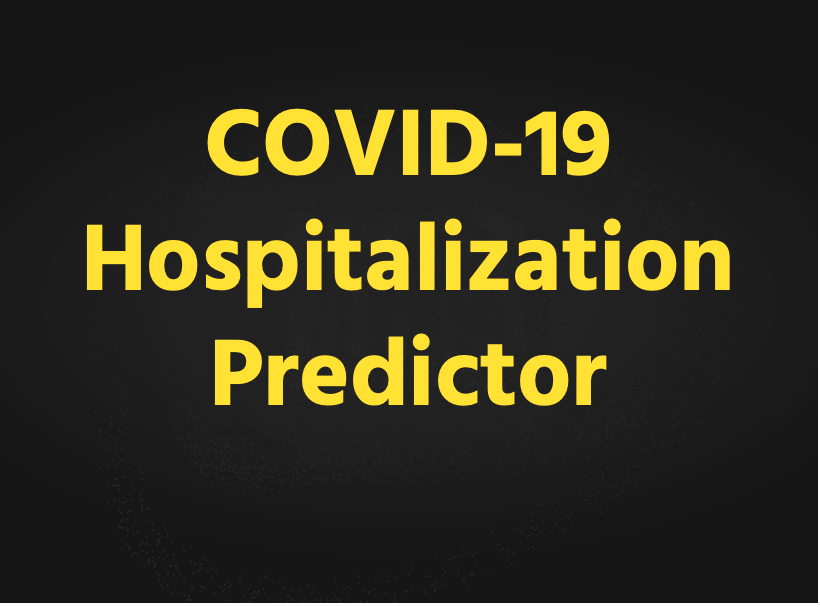

# :material-file-document-outline: Overview

{ align=right width="380" }

## Description 

The COVID-19 Hospitalization Predictor can be used to predict the number of required beds in a hospital given adverse conditions, demographics and diseases.

## Value Proposition 

## Background

## Access COVID-19 Hospitalization Predictor

**COVID-19 Hospitalization Predictor** is available in the H2O Cloud. To learn how to access it, see [Access H2O Healthcare Apps]().

 
=== "Feedback"
    - :material-file-outline: <a href="" target="_blank">Submit and view feedback for this page</a>
    - :material-package-variant-closed: Send feedback about H2O Healthcare to <trushant.kalyanpur@h2o.ai>
