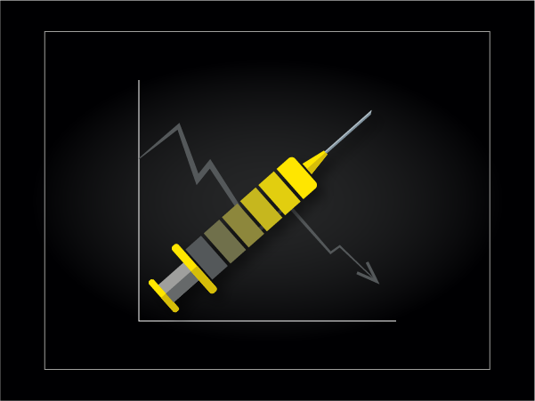
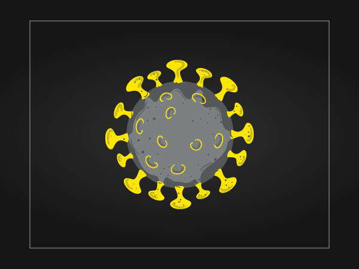
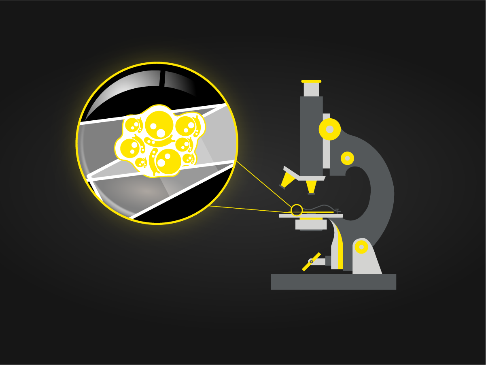

<!-- 
<h1 style="margin-bottom: 10px; font-size:65px; color:black; font-weight: bold;">H2O Health Documentation</h1>

<h1 style="color:black; font-size:30px">**Discover Value in Healthcare and Life Sciences With AI**</h1>

[Get Started](introduction.md){ .md-button .md-button--primary a.button:hover}
 -->

<h1 class="home-page-title">H2O Health Documentation</h1>

[H2O Health](https://h2o.ai/solutions/industry/health/) is an initiative of [H2O.ai](https://www.h2o.ai/) to build AI apps to solve complex healthcare and life science problems while accelerating the discovery of new ideas within the industry. H2O Health is co-innovating with major healthcare organizations to address existing and emerging challenges.

<h3 class="suite-title">Health care apps</h4>

Epidemiology AI refers to the intersectionality of AI and the branch of medicine that concerns itself with the incidence, distribution, and control of diseases and other factors relating to a patient's health.

  <a href="/epidemiology/covid_19_hospital_occupancy_simulator/overview/" class="home-app-link">
    
    Covid-19 Hospital Occupancy Simulator
  </a>

  <a href="/epidemiology/covid_19_hospital_occupancy_simulator/overview/" class="home-app-link">
    
    Covid-19 Forecast
  </a>

  <!-- <a href="/epidemiology/covid_19_hospital_occupancy_simulator/overview/" class="home-app-link">
    
    Covid-19 Vaccination Progress
  </a>

  <a href="/epidemiology/covid_19_hospital_occupancy_simulator/overview/" class="home-app-link">
    
    Covid-19 App
  </a> -->

<!-- 
<h3 class="suite-title">Precision medicine app suite</h4>

Precision medicine is an emerging approach for disease treatment and prevention that takes into account individual variability in genes, environment and lifestyle for each patient.

  <a href="/epidemiology/covid_19_hospital_occupancy_simulator/overview/" class="home-app-link">
    
    Histopathology AI
  </a>

  <a href="/epidemiology/covid_19_hospital_occupancy_simulator/overview/" class="home-app-link">
    
    Cytopathology AI
  </a>

 -->
